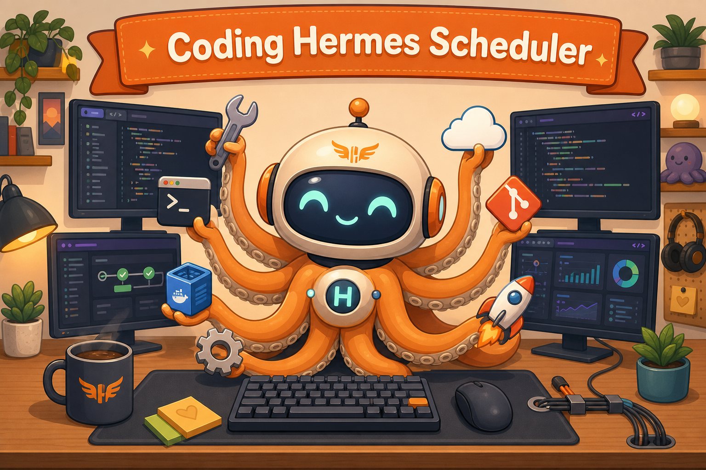
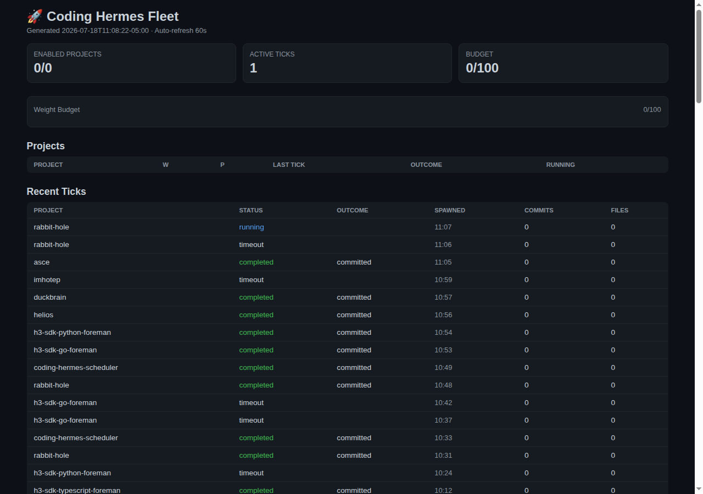

# Coding Hermes Scheduler



A single Go binary that replaces dozens of static cron jobs with a dynamic, priority-weighted fleet scheduler for LLM-powered coding agents.

---

## What It Does

Instead of 33 cron jobs like `*/120 * * * * hermes chat -q "foreman tick for project X"`, you run ONE binary that:

- **Knows all your projects** — weight, priority, cooldown, model, provider
- **Evaluates every 60 seconds** — computes urgency for each project
- **Packs greedily** — fills a weight budget with the most urgent projects
- **Spawns foremen via HTTP** — sends prompts to the Hermes gateway API (`POST /v1/responses`) instead of per-process `hermes chat`. Zero subprocess overhead, zero MCP duplication per tick
- **Falls back gracefully** — if the gateway is unreachable, exec.Command(`hermes`, ...) handles it
- **Tracks outcomes** — every tick is recorded (queued → running → completed/failed)
- **Exposes control** — REST API, MCP, dashboard, DuckBrain sync
- **Auto-approves** — `approvals.cron_mode: auto` for non-interactive foreman ticks

---

## Quick Start

### Prerequisites

- Go 1.23+
- Hermes gateway running with API server enabled (`API_SERVER_KEY` in `.env`)
- SQLite3

### Install

```bash
git clone https://github.com/coding-herms/scheduler.git
cd scheduler
make build
```

### Migrate Existing Cron Jobs

```bash
make migrate-dry    # preview what will be imported
make migrate        # import to SQLite
```

### Run

```bash
./bin/schedulerd
```

Open http://localhost:9090/ for the dashboard.

### Deploy (systemd)

```bash
make deploy-install
sudo systemctl start coding-hermes-scheduler
```

---

## Architecture

```
┌──────────────────────────────────────────────┐
│              HERMES PLUGIN                     │
│  /fleet status, /fleet weight, /fleet pause  │
└──────────────────┬───────────────────────────┘
                   │ HTTP POST /mcp
┌──────────────────▼───────────────────────────┐
│              SCHEDULER (Go binary)            │
│                                               │
│  /         → Dashboard (dark theme HTML)      │
│  /api/v1/  → REST API (15 endpoints)          │
│  /mcp      → MCP server (14 tools)            │
│                                               │
│  Eval Loop (60s):                             │
│    Urgency → Pack → Spawn → Track             │
│                                               │
│  SQLite: projects, ticks, events              │
└──────────────────────────────────────────────┘
```

---

## API Endpoints

| Method | Path | Description |
|--------|------|-------------|
| GET | `/` | Fleet dashboard (HTML) |
| GET | `/api/v1/health` | Health check |
| GET | `/api/v1/status` | Fleet status and budget |
| GET | `/api/v1/projects` | List all projects |
| GET | `/api/v1/projects/:name` | Get project details |
| PUT | `/api/v1/projects/:name` | Update project config |
| POST | `/api/v1/projects/:name/pause` | Pause a project |
| POST | `/api/v1/projects/:name/resume` | Resume a project |
| GET | `/api/v1/ticks` | List recent ticks |
| GET | `/api/v1/ticks/:id` | Get tick details |
| GET | `/api/v1/events` | List event log |
| POST | `/api/v1/evaluate` | Force evaluation cycle |
| POST | `/mcp` | MCP JSON-RPC endpoint |

---

## MCP Tools

| Tool | Description |
|------|-------------|
| `fleet_status` | Fleet-wide status and budget |
| `fleet_projects` | List all projects with config |
| `fleet_project_detail` | Get single project details |
| `fleet_set_weight` | Change project weight (1-100) |
| `fleet_set_priority` | Change project priority (1-10) |
| `fleet_set_cooldown` | Set cooldown duration |
| `fleet_set_decay` | Tune decay rate |
| `fleet_pause` | Pause a project |
| `fleet_resume` | Resume a project |
| `fleet_add` | Add a new project |
| `fleet_ticks` | List ticks for a project |
| `fleet_evaluate` | Force evaluation cycle |
| `fleet_pause_scheduler` | Pause the scheduler |
| `fleet_resume_scheduler` | Resume the scheduler |

---

## Scheduling Model

### Weight (1-100)
How much concurrency budget a project consumes per tick. Budget default: 100.

### Priority (1-10)
How frequently a project runs. Mapped to interval via geometric curve:

```
interval = min_interval × (max_interval / min_interval) ^ ((priority-1) / (levels-1))
```

| Priority | Interval (min=20m, max=24h) |
|----------|----------------------------|
| 10 | 20 minutes |
| 8 | 59 minutes |
| 5 | 5 hours |
| 3 | 14.8 hours |
| 1 | 24 hours |

### Urgency

```
urgency = priority × (1 + time_since_last_run / interval) ^ decay_rate
```

Higher urgency projects get picked first.

### Cooldown

Default 900s between successive ticks for the same project.

---

## Configuration

```bash
./bin/schedulerd \
  -listen 127.0.0.1:9090 \
  -db ~/.hermes/coding-hermes/scheduler.db \
  -foreman-home ~/.hermes/foreman \
  -gateway-url http://127.0.0.1:8642 \
  -min-interval 20m \
  -max-interval 24h \
  -num-levels 10 \
  -budget 100 \
  -max-concurrent 8
```

### Flags

| Flag | Default | Description |
|------|---------|-------------|
| `-listen` | `127.0.0.1:9090` | HTTP listen address |
| `-db` | `~/.hermes/coding-hermes/scheduler.db` | SQLite database path |
| `-foreman-home` | `~/.hermes/foreman` | HERMES_HOME for foreman sessions |
| `-gateway-url` | `http://127.0.0.1:8642` | Hermes gateway API URL |
| `-gateway-key` | `$API_SERVER_KEY` | Hermes gateway API key |
| `-budget` | `100` | Concurrency weight budget |
| `-max-concurrent` | `8` | Max concurrent foreman ticks |
| `-min-interval` | `20m` | Fastest tick interval (priority 10) |
| `-max-interval` | `24h` | Slowest tick interval (priority 1) |
| `-num-levels` | `10` | Number of priority levels |
| `-tick-timeout` | `30m` | Maximum tick duration before kill |
| `-config` | (none) | Path to TOML fleet config file |
| `-namespace-mode` | `false` | Enable multi-namespace scheduling |
| `-test-verify` | `0` | Run N-cycle correctness verification and exit |

Declarative fleet seeding via TOML: `./bin/schedulerd --config fleet.example.toml`

---

## Hermes Plugin

Symlink the plugin to register `/fleet` slash commands:

```bash
ln -s $(pwd)/plugin ~/.hermes/plugins/coding-hermes
```

Commands:
- `/fleet status` — Show fleet status
- `/fleet weight <project> <N>` — Change weight
- `/fleet priority <project> <N>` — Change priority
- `/fleet pause <project>` — Pause project
- `/fleet resume <project>` — Resume project
- `/fleet ticks <project>` — Show tick history
- `/fleet evaluate` — Force evaluation

---

## Skills

This scheduler is part of the Coding Hermes ecosystem. See [`coding-herms/skills`](https://github.com/coding-herms/skills) for:

- `coding-hermes-config` — First-run setup
- `coding-hermes-foreman` — Per-project tick loop
- `coding-hermes-supervisor` — Fleet-wide oversight
- `coding-hermes-broker` — Scheduling algorithm
- `coding-hermes-worker` — Code implementation
- `coding-hermes-north-star` — Architecture reference

---

## Development

```bash
make build       # Build binaries
make test        # Run tests
make test-full   # Full test suite
make lint        # Go vet
make fmt         # Format code
```

### Project Structure

```
cmd/
  schedulerd/    # Scheduler daemon entry point
  migrate/       # Cron → scheduler migration tool
internal/
  api/           # REST API server
  dashboard/     # HTML dashboard generator
  database/      # SQLite schema, migrations, CRUD
  mcp/           # MCP JSON-RPC server
  scheduler/     # Core scheduling engine
  sync/          # DuckBrain read-replica sync
plugin/           # Hermes plugin (Python)
specs/            # Implementation specs
deploy/           # Systemd unit
docs/             # Fleet status, architecture docs
```

## Fleet & Skills

See [docs/fleet.md](docs/fleet.md) for current H3 fleet status — 27 projects, thread mappings, cooldowns, skills map, provider rules.

Skills are maintained in `~/.hermes/skills/coding-hermes-*/` and loaded by the scheduler per-project.

---

## REST API

Full REST API at `http://127.0.0.1:9090/api/v1/`.

| Endpoint | Method | Description |
|----------|--------|-------------|
| `/api/v1/health` | GET | Daemon health, uptime, active ticks |
| `/api/v1/status` | GET | Full fleet status (projects, budget, namespaces) |
| `/api/v1/projects` | GET/POST | List all or register a new project |
| `/api/v1/projects/{name}` | GET/PUT/DELETE | Read, update, or remove a project |
| `/api/v1/ticks` | GET | Tick history with filtering |
| `/api/v1/ticks/{id}` | GET | Single tick detail |
| `/api/v1/events` | GET/STREAM | Event log (SSE streaming supported) |
| `/api/v1/evaluate` | POST | Trigger immediate evaluation cycle |
| `/api/v1/pause` | POST | Pause scheduling |
| `/api/v1/resume` | POST | Resume scheduling |
| `/api/v1/namespaces` | GET/POST | List or create namespaces |
| `/api/v1/namespaces/{id}` | GET/PUT/DELETE | Read, update, or remove a namespace |

## MCP Server

MCP JSON-RPC at `http://127.0.0.1:9090/mcp`. AI agents can control the scheduler via:

| Tool | Description |
|------|-------------|
| `list_projects` | List all projects with status, priority, weight |
| `get_project` | Get a single project by name |
| `enable_project` / `disable_project` | Toggle project on/off |
| `set_priority` / `set_weight` | Adjust scheduling parameters |
| `get_ticks` | Recent tick history for a project |
| `pause_scheduler` / `resume_scheduler` | Pause/resume the eval loop |
| `force_evaluate` | Trigger immediate evaluation |

```json
// Example: List all projects via MCP
{"jsonrpc":"2.0","method":"tools/call","params":{"name":"list_projects","arguments":{}}}
```

## Dashboard

Live HTML dashboard at `http://127.0.0.1:9090/` — auto-refreshes every 60 seconds.



Shows: project fleet overview (enabled/disabled, weight, priority, last tick), recent tick history, namespace allocation with utilization bars, active tick counts, budget gauge.
