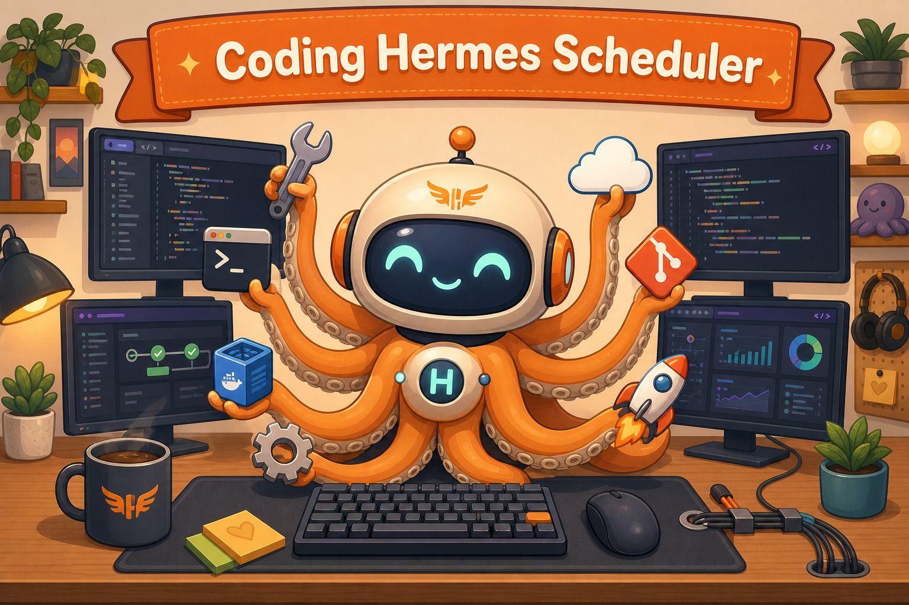
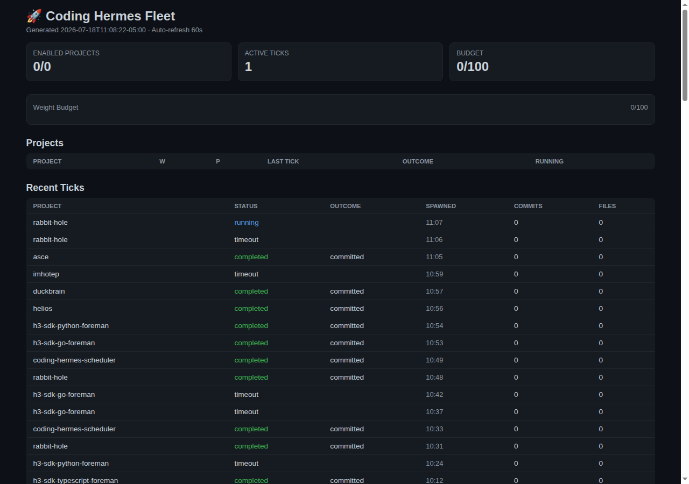

# Coding Hermes Scheduler

[](https://github.com/coding-hermes/scheduler/actions/workflows/ci.yml)



A single Go binary that replaces dozens of static cron jobs with a dynamic, priority-weighted fleet scheduler for LLM-powered coding agents.

---

## What It Does

Instead of 33 cron jobs like `*/120 * * * * hermes chat -q "foreman tick for project X"`, you run ONE binary that:

- **Knows all your projects** — weight, priority, cooldown, model, provider
- **Evaluates on demand** — event-driven (startup, slot-freed debounce, or manual `POST /api/v1/evaluate`) with a 30s min-interval and a 5-min eval-stall watchdog
- **Packs greedily** — fills a weight budget with the most urgent projects
- **Spawns foremen via HTTP** — sends prompts to the Hermes gateway API (`POST /v1/responses`) instead of per-process `hermes chat`. Zero subprocess overhead, zero MCP duplication per tick
- **Falls back gracefully** — if the gateway is unreachable, exec.Command(`hermes`, ...) handles it. **Note:** exec fallback is DISABLED by default (`--no-exec-fallback` defaults to `true` for safety); pass `--no-exec-fallback=false` to re-enable it.
- **Tracks outcomes** — every tick is recorded (queued → running → completed/failed)
- **Exposes control** — REST API, MCP, dashboard, DuckBrain sync
- **Auto-approves** — scheduler agents send `require_approval: false` via the gateway API, so foremen run autonomously without pausing for user confirmation. User-facing chats (Telegram, Discord) keep approvals enabled.

---

## Getting Started (5 minutes)

This guide takes you from zero to a running scheduler with your existing cron jobs imported.

### 1. Prerequisites

- **Go 1.26+** — `go version`
- **Hermes gateway** running with API server enabled — `curl http://127.0.0.1:8642/health`
- **SQLite3** — `sqlite3 --version`
- **Existing cron jobs** in Hermes (the scheduler imports from `~/.hermes/cron/jobs.json`)

### 2. Clone and Build

```bash
git clone https://github.com/coding-hermes/scheduler.git
cd scheduler
make build
```

You now have:
- `./bin/schedulerd` — the daemon
- `./bin/migrate` — cron-to-scheduler migration tool

### 3. Verify API Access

The scheduler spawns foreman ticks through the Hermes gateway API. Verify your gateway is reachable:

```bash
curl http://127.0.0.1:8642/health
# → {"status":"ok","version":"0.18.2"}

# Check that the API server key is set
grep API_SERVER_KEY ~/.hermes/.env
```

### 4. Migrate Cron Jobs

```bash
# Preview what will be imported
make migrate-dry

# Import to SQLite (creates ~/.hermes/coding-hermes/scheduler.db)
make migrate
```

### 5. Run the Scheduler

```bash
# Start the daemon on port 9090
./bin/schedulerd
```

You should see:
```
Database: /home/.../.hermes/coding-hermes/scheduler.db (WAL mode)
Loaded 27 projects, 0 namespaces
GATEWAY: connected to http://127.0.0.1:8642 — using HTTP API instead of exec.Command
HTTP: listening on 127.0.0.1:9090
schedulerd ready
```

### 6. Verify It's Working

```bash
# Health check
curl http://127.0.0.1:9090/api/v1/health
# → {"status":"ok","uptime":"5m","active_ticks":3}

# Fleet status
curl http://127.0.0.1:9090/api/v1/status | jq '.active_projects'

# Open the dashboard
open http://127.0.0.1:9090/
## Deployment

### Systemd

```bash
make deploy-install
sudo systemctl enable --now coding-hermes-scheduler
sudo systemctl status coding-hermes-scheduler
```

The gateway API key is loaded from a 0600 env file (`/etc/coding-hermes/gateway.env` →
`API_SERVER_KEY=...`, template: `deploy/gateway.env.example`) via `EnvironmentFile`;
`cmd/schedulerd/main.go` defaults `--gateway-key` to `$API_SERVER_KEY`. **Never pass
`--gateway-key` on the command line** — argv is world-readable via `ps aux` (GAP-038).

### Local layout note (double nesting)

This repo's canonical checkout on the fleet host lives at
`/home/kara/coding-hermes-scheduler/coding-herms-scheduler/` (typo'd double
nesting — the outer `/home/kara/coding-hermes-scheduler/` directory is NOT the
repo; it holds only the outer `.coding-hermes/tasks.md` pointer and previously
a stale `schedulerd` binary, removed 2026-08-13). Build and run from the inner
checkout: `bin/schedulerd` (the systemd unit builds it via `ExecStartPre`).
`repo_url` for the repo is `github.com/coding-hermes/scheduler` (GAP-039/040).

### Dedicated Gateway (recommended for production)

For production fleets, run the scheduler on a dedicated Hermes gateway instance (separate cgroup, isolated MCPs, independent restart cycle). See [deploy/gateway-setup.md](deploy/gateway-setup.md) for full setup instructions.

```
 Main Gateway (:8642)          Scheduler Gateway (:8643)
   ├─ main chat                   ├─ foreman tick A
   ├─ Telegram bridge             ├─ foreman tick B
   └─ ...                         └─ ...
         ↑                             ↑
    systemd cgroup              separate cgroup (MemoryMax=16G)

### What's Happening

The scheduler evaluates on demand — at startup, when a slot frees up, or via
manual `POST /api/v1/evaluate` (event-driven; 30s minimum interval). On each
evaluation it:
1. Computes urgency for each project (based on priority + time since last run)
2. Packs the most urgent projects into a weight budget (default 100)
3. Spawns foreman ticks via the Hermes gateway API
4. Records outcomes (queued → running → completed/failed)

A 5-minute eval-stall watchdog forces re-evaluation when the fleet sits idle,
so cooldown-expired projects don't go unscheduled (GAP-042).

You can monitor, pause, or adjust any project through the dashboard, REST API, or MCP tools.

---

## Architecture

```
┌──────────────────────────────────────────────┐
│              HERMES PLUGIN                     │
│  /fleet status, /fleet weight, /fleet pause  │
└──────────────────┬───────────────────────────┘
                   │ HTTP POST /mcp
┌──────────────────▼───────────────────────────┐
│              SCHEDULER (Go binary)            │
│                                               │
│  /         → Dashboard (dark theme HTML)      │
│  /api/v1/  → REST API (19 routes)             │
│  /mcp      → MCP server (14 tools)            │
│                                               │
│  Eval Loop (event-driven):                    │
│    Urgency → Pack → Spawn → Track             │
│                                               │
│  SQLite: projects, ticks, events              │
└──────────────────────────────────────────────┘
```

---

## API Endpoints

| Method | Path | Description |
|--------|------|-------------|
| GET | `/` | Fleet dashboard (full HTML page) |
| GET | `/dashboard/partial` | htmx partial: project table refresh |
| GET | `/projects/{name}` | Per-project detail page |
| GET | `/queue` | Global queue view |
| GET | `/ticks?page=N` | Paginated tick history |
| GET | `/namespaces/{id}` | Namespace drill-down |
| GET | `/health` | Dashboard health panel |
| — | `/api/v1/*` | Full REST API — 19 routes (health/status/config, projects CRUD + pause/resume/spawn, namespaces + sub-routes, ticks, events, queue, pause/resume/evaluate): see [docs/api.md](docs/api.md) |
| POST | `/mcp` | MCP JSON-RPC endpoint |

---

## MCP Tools

| Tool | Description |
|------|-------------|
| `fleet_status` | Fleet-wide status and budget |
| `fleet_projects` | List all projects with config |
| `fleet_project_detail` | Get single project details |
| `fleet_set_weight` | Change project weight (1-100) |
| `fleet_set_priority` | Change project priority (1-10) |
| `fleet_set_cooldown` | Set cooldown duration |
| `fleet_set_decay` | Tune decay rate |
| `fleet_pause` | Pause a project |
| `fleet_resume` | Resume a project |
| `fleet_add` | Add a new project |
| `fleet_ticks` | List ticks for a project |
| `fleet_evaluate` | Force evaluation cycle |
| `fleet_pause_scheduler` | Pause the scheduler |
| `fleet_resume_scheduler` | Resume the scheduler |

---

## Scheduling Model

### Weight (1-100)
How much concurrency budget a project consumes per tick. Budget default: 100.

### Priority (1-10)
How frequently a project runs. Mapped to interval via geometric curve:

```
interval = min_interval × (max_interval / min_interval) ^ ((priority-1) / (levels-1))
```

| Priority | Interval (min=30s, max=24h) |
|----------|----------------------------|
| 10 | 30 seconds |
| 8 | ~3 minutes |
| 5 | ~42 minutes |
| 3 | ~4.1 hours |
| 1 | 24 hours |

### Urgency

```
urgency = priority × (1 + time_since_last_run / interval) ^ decay_rate
```

Higher urgency projects get picked first.

### Cooldown

Default 900s between successive ticks for the same project.

### Cooldown Policy (fleet-cooldown-policy.py)

Fleet-wide cooldown normalization is governed by the ops script
`~/.hermes/scripts/fleet-cooldown-policy.py` (not part of this repo — it lives
in the Hermes ops home; run `python3 ~/.hermes/scripts/fleet-cooldown-policy.py`
for a dry run, `--apply` to write). The script:

- Reads the live SQLite state first (`GET /api/v1/projects` equivalent), then
  regenerates `~/.hermes/fleet.toml` so every `[[projects]]` entry's
  `cooldown_s` matches the daemon's current value, and optionally PUTs
  normalized cooldowns back to the API.
- Honors the `ELEVATED_PINS` whitelist (e.g. `h3=21600`, `warpfs=43200`):
  projects with an operator-set pin are never written below their canonical
  cooldown (SCHED-GAP-012), no matter what the SQLite state says.
- Is the **only** writer of `fleet.toml`. `fleet.toml` pins are durable across
  daemon restarts (loader re-pins existing projects at every startup), while
  an API `PUT /api/v1/projects/{name}` cooldown change is durable only within
  the daemon session — the next policy run normalizes it back unless the
  project has an ELEVATED_PINS entry.

**Override procedure:** to pin a project's cooldown permanently, add it to
`ELEVATED_PINS` in `~/.hermes/scripts/fleet-cooldown-policy.py` (and set the
pin in `fleet.toml`), then run the script with `--apply`. The pin survives
policy runs and daemon restarts. See `docs/integration.md` for the full
authority model.

---

## Configuration

```bash
./bin/schedulerd \
  -listen 127.0.0.1:9090 \
  -db ~/.hermes/coding-hermes/scheduler.db \
  -foreman-home ~/.hermes/foreman \
  -gateway-url http://127.0.0.1:8642 \
  -min-interval 30s \
  -max-interval 24h \
  -num-levels 10 \
  -budget 100 \
  -max-concurrent 10
```

### Flags

| Flag | Default | Description |
|------|---------|-------------|
| `-db` | `~/.hermes/coding-hermes/scheduler.db` | SQLite database path |
| `-listen` | `127.0.0.1:9090` | HTTP listen address |
| `-min-interval` | `30s` | Fastest tick interval |
| `-max-interval` | `24h` | Slowest tick interval |
| `-num-levels` | `10` | Number of priority levels |
| `-budget` | `100` | Weight budget |
| `-max-concurrent` | `10` | Max concurrent foremen |
| `-namespace-mode` | `false` | Enable multi-namespace scheduling |
| `-tick-timeout` | `2h` | Maximum tick duration before timeout (2h) |
| `-test-verify` | `0` | Run N-cycle correctness verification and exit |
| `-duckbrain-ns` | `coding-hermes` | DuckBrain namespace for sync |
| `-duckbrain-url` | `http://localhost:3000` | DuckBrain HTTP server URL |
| `-simulate` | `false` | Run in dry-run/simulation mode (no real spawning) |
| `-sim-success` | `0.85` | Simulated success rate (0.0-1.0) |
| `-sim-count` | `0` | Generate N simulated ticks and exit (0 = run loop) |
| `-gateway-url` | `http://127.0.0.1:8642` | Hermes gateway API URL (empty = use exec.Command) |
| `-gateway-key` | `$API_SERVER_KEY` | Hermes gateway API key |
| `-no-exec-fallback` | `true` | Disable exec.Command fallback when gateway fails (default true for safety) |
| `-foreman-home` | `~/.hermes/foreman` | HERMES_HOME path for foreman sessions |
| `-sim-setup` | `false` | Create test fixture with 13 dry-run projects (12 enabled + 1 disabled) |
| `-sim-ticks` | `10` | Number of evaluation ticks to run in sim-setup mode |
| `-config` | (none) | Path to TOML fleet config file |
| `-failure-window` | `100` | Number of recent ticks per project for `/api/v1/status` per-project failure-rate breakdown |
| `-auto-disable-failure-rate` | `0` | Per-project failure-rate threshold (0.0–1.0) for auto-disable; `0` = off |
| `-auto-disable-window` | `100` | Ticks per project over which auto-disable failure rate is computed |
| `-auto-disable-min-ticks` | `50` | Minimum ticks in window before auto-disable can fire |
| `-log-file` | `~/.hermes/coding-hermes/scheduler.log` | Path to append structured tick logs (JSON lines); empty disables |
| `-show-config` | `false` | Print resolved config (CLI + env) as TOML and exit |
| `-schema` | `false` | Output JSON Schema for schedulerd.toml and exit |

Declarative fleet seeding via TOML: `./bin/schedulerd --config fleet.example.toml`

---

## Hermes Plugin

Symlink the plugin to register `/fleet` slash commands:

```bash
ln -s $(pwd)/plugin ~/.hermes/plugins/coding-hermes
```

Commands:
- `/fleet status` — Show fleet status
- `/fleet weight <project> <N>` — Change weight
- `/fleet priority <project> <N>` — Change priority
- `/fleet pause <project>` — Pause project
- `/fleet resume <project>` — Resume project
- `/fleet ticks <project>` — Show tick history
- `/fleet evaluate` — Force evaluation

---

## Skills

This scheduler is part of the Coding Hermes ecosystem. See [`coding-hermes/skills`](https://github.com/coding-hermes/skills) for:

- `coding-hermes-config` — First-run setup
- `coding-hermes-foreman` — Per-project tick loop
- `coding-hermes-supervisor` — Fleet-wide oversight
- `coding-hermes-broker` — Scheduling algorithm
- `coding-hermes-worker` — Code implementation
- `coding-hermes-north-star` — Architecture reference

---

## Development

```bash
make build       # Build binaries
make test        # Run tests
make test-full   # Full test suite
make lint        # Go vet
make fmt         # Format code
```

### Project Structure

```
cmd/
  schedulerd/    # Scheduler daemon entry point
  migrate/       # Cron → scheduler migration tool
internal/
  api/           # REST API server
  dashboard/     # HTML dashboard generator
  database/      # SQLite schema, migrations, CRUD
  mcp/           # MCP JSON-RPC server
  scheduler/     # Core scheduling engine
  sync/          # DuckBrain read-replica sync
plugin/           # Hermes plugin (Python)
specs/            # Implementation specs
deploy/           # Systemd unit
docs/             # Fleet status, architecture docs
```

## Fleet & Skills

See [docs/fleet.md](docs/fleet.md) for current fleet status — regenerated from the live API (`python3 docs/regenerate_fleet.py`), with project counts, thread mappings, cooldowns, skills map, provider rules.

Skills are maintained in `~/.hermes/skills/coding-hermes-*/` and loaded by the scheduler per-project.

---

## REST API

Full REST API at `http://127.0.0.1:9090/api/v1/`.

**API wire format:** responses are snake_case per [specs/S06-rest-api.md](specs/S06-rest-api.md)
(e.g. `active_projects`, `repo_url`, `cooldown_s`, `created_at`). Request
bodies accept snake_case AND the legacy PascalCase Go field names
(`Name`, `RepoURL`, `CooldownS`, `Enabled`, …) so pre-conformance fleet
automation keeps working. On create, omitted `weight`/`priority`/
`cooldown_s`/`decay_rate` default to `10`/`5`/`900`/`1.0`; new projects are
created disabled — resume them explicitly.

**Per-project budgets (SCHED-GAP-066):** `fleet.toml` entries may set
`daily_budget_usd` (UTC-day cap), `weekly_budget_usd` (UTC-week cap, resets
Monday 00:00 UTC), and `final_budget_usd` (one-time lifetime cap, never
resets). All three are opt-in — omitted or `0` means unlimited. Spend is
summed from `ticks.cost_usd`. When any configured cap is reached the project
is excluded from selection (zero new spawns, `blocked_reason="budget"` in
`GET /api/v1/projects`) — running ticks are NEVER killed mid-run. Keys pin on
restart when present in fleet.toml (explicit `0` clears); keyless entries
leave API-assigned caps untouched.

| Endpoint | Method | Description |
|----------|--------|-------------|
| `/api/v1/health` | GET | Daemon health, uptime, active ticks |
| `/api/v1/status` | GET | Full fleet status (projects, budget, namespaces) |
| `/api/v1/config` | GET | Resolved daemon configuration snapshot (gateway key masked) |
| `/api/v1/projects` | GET/POST | List all or register a new project (GET response carries SCHED-GAP-066 budget telemetry: `spent_daily_usd`/`spent_weekly_usd`/`spent_total_usd`, `remaining_*`, `budget_blocked`, `blocked_reason`) |
| `/api/v1/projects/{name}` | GET/PUT/DELETE | Read, update, soft-delete (`?confirm=true`) or purge (`?confirm=true&purge=true`) a project |
| `/api/v1/projects/{name}/pause` | POST | Disable one project (stops it being scheduled) |
| `/api/v1/projects/{name}/resume` | POST | Re-enable a paused project |
| `/api/v1/projects/{name}/spawn` | POST | Manually trigger a tick for one project |
| `/api/v1/ticks` | GET | Tick history with filtering |
| `/api/v1/ticks/{id}` | GET | Single tick detail |
| `/api/v1/events` | GET/STREAM | Event log (SSE streaming supported) |
| `/api/v1/evaluate` | POST | Trigger immediate evaluation cycle |
| `/api/v1/pause` | POST | Pause scheduling |
| `/api/v1/resume` | POST | Resume scheduling |
| `/api/v1/namespaces` | GET/POST | List or create namespaces |
| `/api/v1/namespaces/{id}` | GET/PUT | Read or update a namespace |
| `/api/v1/namespaces/{id}/projects` | GET | List projects assigned to a namespace |
| `/api/v1/namespaces/{id}/move` | POST | Assign a project to a namespace |
| `/api/v1/queue` | GET | All enabled projects by urgency (filter `cooldown_s == 0` for the dispatchable subset) |

**DELETE `/api/v1/projects/{name}` semantics (DOGFOOD-009):** `DELETE` is a
soft delete — it requires `?confirm=true` (else `400`) and refuses enabled
projects with `409` (pause first). On success it returns `200
{"status":"deleted","project":name}`: the row is RETAINED (still listed by
`GET /api/v1/projects` and `GET /projects/{name}`), stamped `enabled=false`,
`disabled_by='api-delete'`, `disabled_reason='soft-deleted via DELETE
?confirm=true'`, `disabled_at=<now>`. Soft-deleted rows keep their historical
ticks referentially valid and remain visible in listings. To permanently
remove the row instead, add `?purge=true` (i.e.
`DELETE /api/v1/projects/{name}?confirm=true&purge=true`) — purge has its own
confirm requirement (`?purge=true` alone is refused with `400`), still refuses
enabled projects with `409`, and on success returns `200
{"status":"purged","project":name}` with the row permanently removed from the
projects table. Historical ticks are retained (they reference projects by
name string) but no longer contribute to `/api/v1/status`
`projects_failure_rates`, which only includes existing projects.

## MCP Server

MCP JSON-RPC at `http://127.0.0.1:9090/mcp`. AI agents can control the scheduler via the 14 `fleet_*` tools listed in [MCP Tools](#mcp-tools):

```json
// Example: List all projects via MCP
{"jsonrpc":"2.0","method":"tools/call","params":{"name":"fleet_projects","arguments":{}}}
```

## Dashboard

Live HTML dashboard at `http://127.0.0.1:9090/` — htmx-powered live updates: fleet overview and health panel every 10s, queue and tick history every 30s.



Shows: project fleet overview (enabled/disabled, weight, priority, last tick), recent tick history, namespace allocation with utilization bars, active tick counts, budget gauge.
