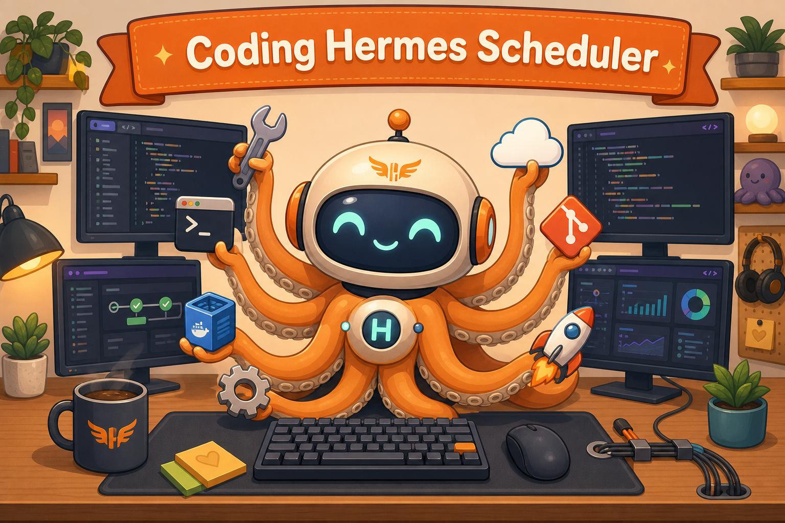
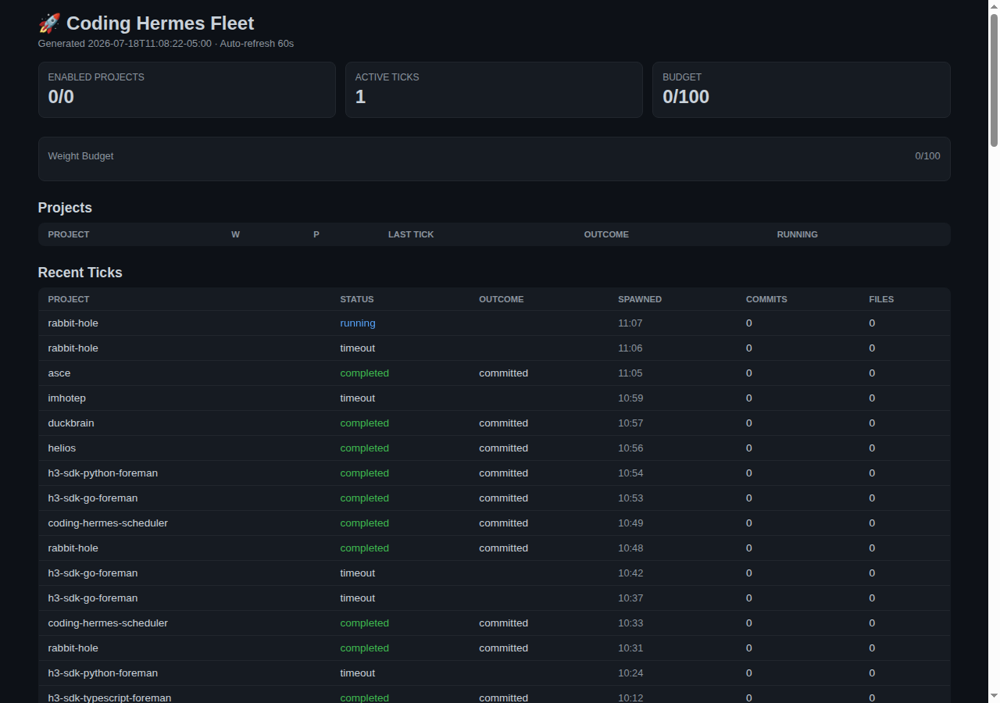

# Coding Hermes Scheduler

[](https://github.com/coding-hermes/scheduler/actions/workflows/ci.yml)
[](https://github.com/coding-hermes/scheduler/actions/workflows/ci.yaml)

Both workflows gate every push to `main` (each runs checks the other does
not — see [docs/ci-workflows.md](docs/ci-workflows.md)), so neither badge
alone reflects the full gate.



A single Go binary that replaces dozens of static cron jobs with a dynamic, priority-weighted fleet scheduler for LLM-powered coding agents.

---

## What It Does

Instead of 33 cron jobs like `*/120 * * * * hermes chat -q "foreman tick for project X"`, you run ONE binary that:

- **Knows all your projects** — weight, priority, cooldown, model, provider
- **Evaluates on demand** — event-driven (startup, slot-freed debounce, or manual `POST /api/v1/evaluate`) with a 30s min-interval and a 5-min eval-stall watchdog
- **Packs greedily** — fills a weight budget with the most urgent projects
- **Spawns foremen via HTTP** — sends prompts to the Hermes gateway API (`POST /v1/responses`) instead of per-process `hermes chat`. Zero subprocess overhead, zero MCP duplication per tick
- **Falls back gracefully** — if the gateway is unreachable, exec.Command(`hermes`, ...) handles it. **Note:** exec fallback is DISABLED by default (`--no-exec-fallback` defaults to `true` for safety); pass `--no-exec-fallback=false` to re-enable it.
- **Tracks outcomes** — every tick is recorded (queued → running → completed/failed)
- **Exposes control** — REST API, MCP, dashboard, DuckBrain sync
- **Auto-approves** — scheduler agents send `require_approval: false` via the gateway API, so foremen run autonomously without pausing for user confirmation. User-facing chats (Telegram, Discord) keep approvals enabled.

---

## Getting Started (5 minutes)

> ## ⚠️ BROKEN/STALE warning — verify before you trust this guide (GAP-042)
>
> **The public repo may be broken or stale relative to local fleet fixes.** This warning was written against `origin/main` commit `bb104c8` (`bb104c841edcc79a87166fef1dd5b551e8327d63`) on 2026-08-30.
>
> Verified state at that commit: a **fresh clone passes `make test`** — the repo is not currently known-broken, and no unpushed fleet fixes were found at write time. But the fleet's canonical checkout is a separate working copy: local fixes land there first and can lag this public repo, so what is on `main` here may be broken or stale relative to what the fleet actually runs at any later time.
>
> **Always run `make test` on a fresh clone before trusting the steps below.** If it fails or the steps misbehave, open a [release-check task](.github/ISSUE_TEMPLATE/release-check.md) and let a human gate the fix and push — agents never auto-push.

This guide takes you from zero to a running scheduler with your existing cron jobs imported.

### 1. Prerequisites

- **Go 1.26+** — `go version`
- **Hermes gateway** running with API server enabled — `curl http://127.0.0.1:8642/health`
- **SQLite3** — `sqlite3 --version`
- **Existing cron jobs** in Hermes (the scheduler imports from `~/.hermes/cron/jobs.json`)

### 2. Clone and Build

```bash
git clone https://github.com/coding-hermes/scheduler.git
cd scheduler
make build
```

You now have:
- `./bin/schedulerd` — the daemon
- `./bin/migrate` — cron-to-scheduler migration tool

### 3. Verify API Access

The scheduler spawns foreman ticks through the Hermes gateway API. Verify your gateway is reachable:

```bash
curl http://127.0.0.1:8642/health
# → {"status":"ok","version":"0.18.2"}

# Check that the API server key is set
grep API_SERVER_KEY ~/.hermes/.env
```

### 4. Migrate Cron Jobs

**Eligibility.** The migration tool only imports jobs that pass BOTH filters:

1. **Coding-hermes job** — the job name (case-insensitive) or any of its skills must contain `coding-hermes` or `foreman`.
2. **Workdir in prompt** — the job prompt must contain a workdir path, e.g. `Workdir: /home/...` or `workdir /home/...`.

Ineligible jobs are skipped with a per-job `SKIP <name>: ...` reason in the output, so you can see exactly why each job was not imported.

```bash
# Preview what will be imported
make migrate-dry

# Import to SQLite (creates ~/.hermes/coding-hermes/scheduler.db)
make migrate
```

### 5. Run the Scheduler

Every environment variable the daemon reads (precedence chain, env-only credentials, knobs with no flag) is tabulated in [docs/reference/env-vars.md](docs/reference/env-vars.md).

```bash
# Start the daemon on port 9090
./bin/schedulerd
```

You should see:
```
Database: /home/.../.hermes/coding-hermes/scheduler.db (WAL mode)
Loaded 27 projects, 0 namespaces
GATEWAY: connected to http://127.0.0.1:8642 — using HTTP API instead of exec.Command
HTTP: listening on 127.0.0.1:9090
schedulerd ready
```

### 6. Verify It's Working

```bash
# Health check
curl http://127.0.0.1:9090/api/v1/health
# → {"status":"ok","uptime":"5m","active_ticks":3}

# Fleet status
curl http://127.0.0.1:9090/api/v1/status | jq '.active_projects'

# Open the dashboard
open http://127.0.0.1:9090/
```

### 7. Create Your First Project

A new project is added via `POST /api/v1/projects` and **all three** of `name`,
`repo_url`, and `workdir` are required — a missing field returns 400 with the
exact names. The example below shows each one with its source:

**Operator credential required (SCHED-GAP-1619):** `SCHEDULER_OPERATOR_TOKEN`
must be set on the daemon, and every mutating request must present it as
`-H "Authorization: Bearer $SCHEDULER_OPERATOR_TOKEN"`. With no credential
configured the daemon fails closed — every mutation is refused with **503**;
with one configured, a missing or wrong credential gets **401**.

```bash
curl -s -X POST http://127.0.0.1:9090/api/v1/projects \
  -H 'Content-Type: application/json' \
  -H "Authorization: Bearer $SCHEDULER_OPERATOR_TOKEN" \
  -d '{
    "name":     "my-project",                                   # fleet-unique name
    "repo_url": "github.com/your-org/my-project",               # what the foreman reads
    "workdir":  "/home/your-name/my-project"                    # where the foreman runs
  }'
# 201 (with a valid operator credential) — defaults applied, created DISABLED:
# {"name":"my-project","weight":10,"priority":5,"cooldown_s":900,
#  "decay_rate":1,"enabled":false,"created_at":"...", ...}
```

**Cooldown default split (SCHED-GAP-195):** this API create path defaults
`cooldown_s` to **900** (15 min — an interactive create is meant to be
observed soon). A project seeded from `fleet.toml`/config instead gets the
**7200** (2 h) baseline resolved by `internal/config/loader.go`. The two
defaults are intentional and producer-specific — know which producer you
used before assuming a cooldown.

**New projects arrive `enabled: false`** — creating never auto-enables. The
queue will stay empty until you enable the project explicitly:

```bash
# Option A — set enabled=true via the canonical project update route
curl -s -X PUT http://127.0.0.1:9090/api/v1/projects/my-project \
  -H 'Content-Type: application/json' \
  -H "Authorization: Bearer $SCHEDULER_OPERATOR_TOKEN" \
  -d '{"enabled":true}'

# Option B — use the convenience sub-route (same effect, single call)
curl -s -X POST http://127.0.0.1:9090/api/v1/projects/my-project/resume \
  -H "Authorization: Bearer $SCHEDULER_OPERATOR_TOKEN"
```

After either call, a `GET /api/v1/projects/my-project` will show
`"enabled":true` and the scheduler will pick the project up on the next
evaluation cycle. The full project body is documented under
[POST /api/v1/projects](docs/api.md#post-apiv1projects); the migration tool
(`make migrate`) is the faster path if you are importing existing cron jobs.

## Deployment

### Systemd

```bash
make deploy-install
sudo systemctl enable --now coding-hermes-scheduler
sudo systemctl status coding-hermes-scheduler
```

The gateway API key is loaded from a 0600 env file (`/etc/coding-hermes/gateway.env` →
`API_SERVER_KEY=...`, template: `deploy/gateway.env.example`) via `EnvironmentFile`;
`cmd/schedulerd/main.go` defaults `--gateway-key` to `$API_SERVER_KEY`. **Never pass
`--gateway-key` on the command line** — argv is world-readable via `ps aux` (GAP-038).

### Local layout note (double nesting)

This repo's canonical checkout on the fleet host lives at
`/home/kara/coding-hermes-scheduler/coding-herms-scheduler/` (typo'd double
nesting — the outer `/home/kara/coding-hermes-scheduler/` directory is NOT the
repo; it holds only the outer `.coding-hermes/tasks.md` pointer and previously
a stale `schedulerd` binary, removed 2026-08-13). Build and run from the inner
checkout: `bin/schedulerd` (the systemd unit builds it via `ExecStartPre`).
`repo_url` for the repo is `github.com/coding-hermes/scheduler` (GAP-039/040).
2026-09-26 (CLN-1): the outer directory is now exactly that pointer — stale
siblings there (an older README copy, a stale `.gitignore`, a 0-byte
`scheduler.db`, and a duplicate `internal/database` tree written by a
mis-rooted command) were archived out. Do not add files to the outer
directory; anything that is not the repo belongs in the inner checkout.

### Dedicated Gateway (recommended for production)

For production fleets, run the scheduler on a dedicated Hermes gateway instance (separate cgroup, isolated MCPs, independent restart cycle). See [deploy/gateway-setup.md](deploy/gateway-setup.md) for full setup instructions.

```
 Main Gateway (:8642)          Scheduler Gateway (:8643)
   ├─ main chat                   ├─ foreman tick A
   ├─ Telegram bridge             ├─ foreman tick B
   └─ ...                         └─ ...
         ↑                             ↑
    systemd cgroup              separate cgroup (MemoryMax=16G)
```

### What's Happening

The scheduler evaluates on demand — at startup, when a slot frees up, or via
manual `POST /api/v1/evaluate` (event-driven; 30s minimum interval). On each
evaluation it:
1. Computes urgency for each project (based on priority + time since last run)
2. Packs the most urgent projects into a weight budget (default 100)
3. Spawns foreman ticks via the Hermes gateway API
4. Records outcomes (queued → running → completed/failed)

A 5-minute eval-stall watchdog forces re-evaluation when the fleet sits idle,
so cooldown-expired projects don't go unscheduled (GAP-042).

You can monitor, pause, or adjust any project through the dashboard, REST API, or MCP tools.

---

## Architecture

```
┌──────────────────────────────────────────────┐
│              HERMES PLUGIN                     │
│  /fleet status, /fleet weight, /fleet pause  │
└──────────────────┬───────────────────────────┘
                   │ HTTP POST /mcp
┌──────────────────▼───────────────────────────┐
│              SCHEDULER (Go binary)            │
│                                               │
│  /         → Dashboard (dark theme HTML)      │
│  /api/v1/  → REST API (docs/api.md)           │
│  /mcp      → MCP server (47 tools)            │
│                                               │
│  Eval Loop (event-driven):                    │
│    Urgency → Pack → Spawn → Track             │
│                                               │
│  SQLite: projects, ticks, events              │
└──────────────────────────────────────────────┘
```

---

## API Endpoints

| Method | Path | Description |
|--------|------|-------------|
| GET | `/` | Fleet dashboard (full HTML page) |
| GET | `/dashboard/partial` | htmx partial: project table refresh |
| GET | `/projects/{name}` | Per-project detail page |
| GET | `/queue` | Global queue view |
| GET | `/ticks?page=N` | Paginated tick history |
| GET | `/namespaces/{id}` | Namespace drill-down |
| GET | `/health` | Dashboard health panel |
| — | `/api/v1/*` | Full REST API — health/status/config, projects CRUD + pause/resume/spawn/bump/unbump, namespaces + sub-routes, ticks, events, queue, fleet metrics, pause/resume/evaluate, deploy groups/templates (full route index in [docs/api.md](docs/api.md); groups/templates request bodies in `GET /api/v1/openapi.json`) |
| GET | `/api/v1/events` | Event log (severity/limit/since filters; SSE push stream at `/api/v1/events/stream`) |
| GET | `/api/v1/groups` | List deploy groups (JSONL-backed) |
| POST | `/api/v1/groups` | Create a deploy group |
| GET | `/api/v1/groups/{name}` | Get one deploy group |
| PUT | `/api/v1/groups/{name}` | Partial-update a deploy group (name immutable) |
| DELETE | `/api/v1/groups/{name}` | Delete a deploy group (JSONL row removed) |
| POST | `/api/v1/groups/{name}/deploy` | Deploy a template to a group — appends the template's task rows to each member project's board; `dry_run=true` plans without writing |
| GET | `/api/v1/templates` | List deploy templates (JSONL-backed) |
| POST | `/api/v1/templates` | Create a deploy template |
| GET | `/api/v1/templates/{name}` | Get one deploy template |
| PUT | `/api/v1/templates/{name}` | Partial-update a deploy template (name immutable) |
| DELETE | `/api/v1/templates/{name}` | Delete a deploy template (JSONL row removed) |
| POST | `/mcp` | MCP JSON-RPC endpoint |

---

## MCP Tools

All 47 tools served by `POST /mcp` (`tools/list` is the live source — the
[docs parity test](internal/mcp/readme_tools_parity_test.go) fails when this
table drifts from the registry). Verify the running daemon's surface (a
daemon built from this tree reports 45; an older deployed build reports
fewer):

```sh
curl -s http://127.0.0.1:9090/mcp -H 'Content-Type: application/json' \
  -d '{"jsonrpc":"2.0","id":1,"method":"tools/list"}' | jq '.result.tools | length'
```

| Tool | Description |
|------|-------------|
| `fleet_status` | Fleet-wide status and budget |
| `fleet_projects` | List all projects with config |
| `fleet_project_detail` | Get single project details |
| `fleet_set_weight` | Change project weight (1-100) |
| `fleet_set_priority` | Change project priority (1-10) |
| `fleet_set_cooldown` | Set cooldown duration |
| `fleet_set_decay` | Tune decay rate |
| `fleet_set_model` | Set a project's model/provider pair (one coherent unit — both required) |
| `fleet_set_budget` | Set daily/weekly/final USD spend caps (only supplied windows are written) |
| `fleet_set_prompt` | Set the project prompt + mode (empty prompt clears to the namespace default) |
| `fleet_set_enabled` | Enable/disable a project (disable stamps GAP-044 provenance) |
| `fleet_pause` | Pause a project |
| `fleet_resume` | Resume a project |
| `fleet_add` | Add a new project |
| `fleet_ticks` | List ticks for a project |
| `fleet_evaluate` | Force evaluation cycle |
| `fleet_pause_scheduler` | Pause the scheduler |
| `fleet_resume_scheduler` | Resume the scheduler |
| `groups_list` | List deploy groups (JSONL-backed) |
| `groups_get` | Get one deploy group by name |
| `groups_create` | Create a deploy group (named project list) |
| `groups_update` | Partially update a group (projects and/or description) |
| `groups_delete` | Delete a deploy group |
| `templates_list` | List deploy templates (JSONL-backed) |
| `templates_get` | Get one deploy template by name |
| `templates_create` | Create a deploy template (named task definitions) |
| `templates_update` | Partially update a template (description and/or tasks) |
| `templates_delete` | Delete a deploy template |
| `groups_deploy` | Deploy a template's task rows to every member project of a group (`dry_run` plans without writing) |
| `events_list` | Read the event log (`since` returns only events with id > since) |
| `namespaces_list` | List all namespaces (allocation pools) |
| `namespaces_get` | Get one namespace by id (weight, caps, admission_mode, load_gate) |
| `namespaces_create` | Create a namespace (id + positive weight required) |
| `namespaces_update` | Partially update a namespace (only passed fields are written) |
| `namespaces_delete` | Delete a namespace (`confirm=true` soft / `confirm=true&purge=true` hard) |
| `namespaces_projects` | List projects assigned to a namespace |
| `namespaces_move` | Assign a project to a namespace |
| `project_delete` | Delete a project (`confirm`/`purge` semantics as the REST route; refused while enabled) |
| `project_spawn` | Spawn a tick for a project immediately (bypasses cooldown) |
| `project_bump` | Temporarily accelerate a project (reason required, 1-8 ticks) |
| `project_unbump` | Abort an active bump, restoring pre-bump cooldown |
| `tick_get` | Get one tick by id (includes worker waves when present) |
| `config_get` | Resolved runtime config (honest subset: db_path, weight_budget, paused, version) |
| `queue_get` | Scheduling queue: enabled projects by urgency, descending |
| `metrics_get` | Fleet metrics in one read-only call (each block states `available=true\|false`) |
| `features_get` | Per-feature live usage counters (SCHED-GAP-131) — every tracked mechanism's `use_count` + first/last-used, plus the `admission_mode_rows` gauge |
| `features_prune_candidates` | Dead-feature reaper report (SCHED-GAP-131) — mechanisms never used or last used more than `weeks` ago (default 8); flag only |

---

## Scheduling Model

### Weight (1-100)
How much concurrency budget a project consumes per tick. Budget default: 100.

### Priority (1-10)
How frequently a project runs. Mapped to interval via geometric curve:

```
interval = max_interval / (max_interval / min_interval) ^ ((priority-1) / (levels-1))
```

| Priority | Interval (min=30s, max=24h) |
|----------|----------------------------|
| 10 | 30 seconds |
| 8 | ~3 minutes |
| 5 | ~42 minutes |
| 3 | ~4.1 hours |
| 1 | 24 hours |

### Urgency

```
urgency = priority × (1 + time_since_last_run / interval) ^ decay_rate
```

Higher urgency projects get picked first.

### Cooldown

Default 900s between successive ticks for the same project.

### Cooldown Policy (fleet-cooldown-policy.py)

Fleet-wide cooldown normalization is governed by the ops script
`~/.hermes/scripts/fleet-cooldown-policy.py` (not part of this repo — it lives
in the Hermes ops home; run `python3 ~/.hermes/scripts/fleet-cooldown-policy.py`
for a dry run, `--apply` to write). The script:

- Reads the live SQLite state first (`GET /api/v1/projects` equivalent), then
  regenerates `~/.hermes/fleet.toml` so every `[[projects]]` entry's
  `cooldown_s` matches the daemon's current value, and optionally PUTs
  normalized cooldowns back to the API.
- Honors the `ELEVATED_PINS` whitelist (e.g. `h3=21600`, `warpfs=43200`):
  projects with an operator-set pin are never written below their canonical
  cooldown (SCHED-GAP-012), no matter what the SQLite state says.
- Is the **only** writer of `fleet.toml`. `fleet.toml` pins are durable across
  daemon restarts (loader re-pins existing projects at every startup), while
  an API `PUT /api/v1/projects/{name}` cooldown change is durable only within
  the daemon session — the next policy run normalizes it back unless the
  project has an ELEVATED_PINS entry.
- Guarded against clobber (SCHED-PERF-006): the pre-commit hook and the
  deploy-drain-restart verify block run
  `scripts/policy-script-deploy-hash-guard.sh`, which aborts loudly whenever
  the live `fleet-cooldown-policy.py` has diverged from its canonical
  sidecar, so a consumer deploy/restart can no longer silently overwrite an
  operator's live fix.

**Override procedure:** to pin a project's cooldown permanently, add it to
`ELEVATED_PINS` in `~/.hermes/scripts/fleet-cooldown-policy.py` (and set the
pin in `fleet.toml`), then run the script with `--apply`. The pin survives
policy runs and daemon restarts. See `docs/integration.md` for the full
authority model.

---

## Configuration

Every environment variable the daemon reads — precedence chain (flag > env > TOML > default), the env-only credentials (`SCHEDULER_OPERATOR_TOKEN`, `API_SERVER_KEY`), and the knobs with no flag — is tabulated in [docs/reference/env-vars.md](docs/reference/env-vars.md).

```bash
./bin/schedulerd \
  -listen 127.0.0.1:9090 \
  -db ~/.hermes/coding-hermes/scheduler.db \
  -foreman-home ~/.hermes/foreman \
  -gateway-url http://127.0.0.1:8642 \
  -min-interval 30s \
  -max-interval 24h \
  -num-levels 10 \
  -budget 100 \
  -max-concurrent 10
```

### Flags

| Flag | Default | Description |
|------|---------|-------------|
| `-db` | `~/.hermes/coding-hermes/scheduler.db` | SQLite database path |
| `-listen` | `127.0.0.1:9090` | HTTP listen address |
| `-public-url` | _(empty)_ | Public base URL of the dashboard (e.g. `https://sched.example.com`) used to build tick-report permalinks for `deliver_mode=link`; empty = link mode falls back to full (SCHED-GAP-1607). Env: `SCHEDULER_PUBLIC_URL` |
| `-min-interval` | `30s` | Fastest tick interval |
| `-max-interval` | `24h` | Slowest tick interval |
| `-num-levels` | `10` | Number of priority levels |
| `-budget` | `100` | Weight budget |
| `-max-concurrent` | `10` | Max concurrent foremen |
| `-namespace-mode` | `false` | Enable multi-namespace scheduling |
| `-tick-timeout` | `2h` | Maximum tick duration before timeout (2h) |
| `-api-read-timeout` | `5s` | Per-request deadline for the heavy read API surfaces (`/api/v1/status`, `/projects`, `/namespaces`, `/ticks`); a stalled DB helper returns 504 naming the helper instead of hanging the handler (SCHED-GAP-1575-B; `<= 0` = keep the 5s default) |
| `-test-verify` | `0` | Run N-cycle correctness verification and exit |
| `-duckbrain-ns` | `scheduler` | DuckBrain namespace for sync |
| `-duckbrain-url` | `http://localhost:3000` | DuckBrain HTTP server URL |
| `-simulate` | `false` | Run in dry-run/simulation mode (no real spawning) |
| `-sim-success` | `0.85` | Simulated success rate (0.0-1.0) |
| `-sim-count` | `0` | Generate N simulated ticks and exit (0 = run loop) |
| `-gateway-url` | `http://127.0.0.1:8642` | Hermes gateway API URL (empty = use exec.Command) |
| `-gateway-key` | `$API_SERVER_KEY` | Hermes gateway API key |
| `-no-exec-fallback` | `true` | Disable exec.Command fallback when gateway fails (default true for safety) |
| `-foreman-home` | `~/.hermes/foreman` | HERMES_HOME path for foreman sessions |
| `-sim-setup` | `false` | Create test fixture with 13 dry-run projects (12 enabled + 1 disabled) |
| `-sim-ticks` | `10` | Number of evaluation ticks to run in sim-setup mode |
| `-config` | (none) | Path to TOML fleet config file |
| `-failure-window` | `100` | Number of recent ticks per project for `/api/v1/status` per-project failure-rate breakdown |
| `-auto-disable-failure-rate` | `0` | Per-project failure-rate threshold (0.0–1.0) for auto-disable; `0` = off |
| `-auto-disable-window` | `100` | Ticks per project over which auto-disable failure rate is computed |
| `-auto-disable-min-ticks` | `50` | Minimum ticks in window before auto-disable can fire |
| `-log-file` | `~/.hermes/coding-hermes/scheduler.log` | Path to append structured tick logs (JSON lines); empty disables. Default derived from `-db` (SCHED-GAP-1647): the default/production db keeps this path, any other db logs to `<db>.log`; an explicit `-log-file` always wins |
| `-show-config` | `false` | Print resolved config (CLI + env) as TOML and exit |
| `-schema` | `false` | Output JSON Schema for schedulerd.toml and exit |
| `-duckbrain-interval` | `5m0s` | DuckBrain sync interval (spool replay cadence) |
| `-gateway-response-timeout` | `30m0s` | Per-turn deadline for a gateway /v1/responses POST; a stalled POST fails the tick before `--tick-timeout` (SCHED-GAP-117; 0 disables) |
| `-peer-freshness-window` | `180` | Peer freshness window in seconds for the federation peer registry (REMOTE-003): a peer whose last `POST /api/v1/peers/{id}/heartbeat` is older renders `stale:true` (with its `last_contact`, never a "down" state) on `GET /api/v1/peers`. Env: `SCHEDULER_PEER_FRESHNESS_WINDOW` |
| `-groups-file` | (none) | JSONL file for deploy groups (default `<db dir>/groups.jsonl` when the blocks store is enabled; empty = default paths) |
| `-load-gate-threshold` | `0` | Defer new spawns while the 1-minute load average is at or above this value (SCHED-GAP-125); `0` = disabled. Work is deferred, not dropped — it runs once load drops. Namespaces opt out via `load_gate='off'` |
| `-feature-prune-weeks` | `8` | Prune window (weeks) for the dead-feature reaper (SCHED-GAP-131): `/api/v1/features/prune-candidates` flags mechanisms whose last proven use is older than this (or never used). Flag only — nothing is auto-deleted |
| `-model-rates-file` | (none) | JSON price-sticker file applied over the builtin model rates at startup (ADV-R09/G8): `{as_of, models:{name:{in_per_m,out_per_m}}, providers:{...}}` — refresh stickers without a rebuild |
| `-reap-sessions` | `false` | Run one SCHED-GAP-089 reap pass against the agent state store (`~/.hermes/state.db`) and exit — DRY-RUN by default, writes nothing |
| `-reap-sessions-apply` | `false` | With `--reap-sessions`: APPLY the pass — close selected sessions (`ended_at` + `end_reason='reaped'`). Without it the pass is a dry-run (SCHED-GAP-089) |
| `-session-db` | `~/.hermes/state.db` | Agent state database path for `--reap-sessions` (SCHED-GAP-089) |
| `-session-reap-threshold` | `24h0m0s` | Stale api_server session reap threshold (SCHED-GAP-089; default 24h) |
| `-sim-idle` | `0` | Fraction of completed sim ticks with zero commits (0-1) — exercises adaptive-cooldown slow-down in dry-runs |
| `-slot-patience` | `5m0s` | How long a tick waits for a free slot before being dropped; the drop emits an event (ADV-R08/G3) |
| `-spawn-mem-limit-mb` | `0` | Per-spawn RLIMIT_AS memory cap in MiB applied to spawned foreman processes (ADV-R11, GAP-048 cure); `0` = off (default). NOT an admission gate — every selected project still spawns; the cap constrains the spawned process's resources at spawn time (inherited by its workers). Best-effort: a failed cap WARNs and the spawn continues |
| `-tasks-pacing` | `1m0s` | Minimum post-tick spacing before a tasks-mode project re-admits, +up to 20% jitter (SCHED-GAP-136); `0` = disabled. Library default 0; the fleet binary ships 60s. Composes with (never replaces) failure backoff |
| `-templates-file` | (none) | JSONL file for deploy templates (default `<db dir>/templates.jsonl` when the blocks store is enabled; empty = default paths) |
| `-verify-board` | (none) | Check board closure-evidence violations (SCHED-GAP-085): exit 0 when no closed row is missing all of reasoning/commit_hash/worker_summary, exit 1 when any |
| `-version` | `false` | Print version/build info and exit |

Declarative fleet seeding via TOML: `./bin/schedulerd --config fleet.example.toml`

#### DuckBrain sync auth (`DUCKBRAIN_API_KEY`)

When `DUCKBRAIN_API_KEY` is set, every sync request carries it as the `X-API-Key` header — the daemon validates the key once at startup with a side-effect-free probe, and a rejected key (HTTP 401/403) fails fast with a distinct HIGH `DuckBrain API key REJECTED` event instead of spooling every failed write. A 429 from the DuckBrain daemon is treated as backpressure rather than an error: the current burst stops, the remaining writes spool, and they replay on the next `-duckbrain-interval` tick. With the env var unset or empty the daemon stays in pre-auth compatibility mode — no probe is made and no `X-API-Key` header is sent (deliberate, not a bug).

### Model chains, per-namespace caps, and foreman prompts (fleet.toml)

Every spawn resolves its model/provider by walking an ordered fallback chain
left-to-right — the first non-empty model and the first non-empty provider,
resolved independently, win (`internal/scheduler/spawn.go`, `resolveChain`).
The chain has three tiers:

1. **Project tier** — either the project's `model` + `fallback_model` /
   `provider` + `fallback_provider` fields (legacy shape), or, when set, the
   project's `model_chain` (a JSON array of `"model@provider"` hops, which
   REPLACES those fields as the project tier — `spawn.go`, `spawnChain`).
2. **Namespace tier** — the namespace's `model_chain` hops, appended AFTER the
   project chain and BEFORE the global defaults (`spawn.go`, `spawnChain`).
3. **Global tier** — the spawner env defaults (`SCHEDULER_FOREMAN_MODEL` /
   `_PROVIDER` and their `_FALLBACK_*` counterparts). Skipped entirely when
   the project sets `no_global_fallback = true`.

```toml
[[projects]]
model = "deepseek-v4-flash"          # tier 1 (legacy shape) — primary
fallback_model = "deepseek-v4-pro"   # tier 1 fallback
# OR, as a full chain replacing the fields above (SCHED-GAP-075):
#model_chain = ["deepseek-v4-flash@deepseek-foreman", "deepseek-v4-pro@deepseek-foreman"]

[[namespaces]]
# tier 2: hops appended after the project chain, before the global defaults
#model_chain = ["kimi-k3@kimi-for-coding", "deepseek-v4-flash@deepseek-foreman"]
```

**Durability:** the scheduler seeds `model_chain` (project and namespace)
into SQLite when the row is CREATED from fleet.toml; it does NOT re-pin the
chain on an existing row at boot (`internal/config/loader.go` — `ApplyFleetConfig`
pins `model`/`provider`/`cooldown_s`/`enabled` on every restart, but `model_chain`
flows only through the create path). A fleet.toml project with no explicit
`cooldown_s` gets the config-seeded default **7200** (2 h baseline,
`defaultProjectCooldown` in `loader.go`) — NOT the API-create default of
**900** that `POST /api/v1/projects` stamps on interactive creates
(SCHED-GAP-195); the split is intentional: config-seeded projects are fleet
policy and run cold, API-created projects are operator actions observed soon.
Change a chain on a live namespace via
`PUT /api/v1/namespaces/{id}` (`{"model_chain": "[...]"}`), on a live project via
`PUT /api/v1/projects/{name}` (`{"model_chain": "[...]"}` — `""` clears it).
Invalid JSON or an empty array contributes nothing to the chain (`spawn.go`,
`parseModelChain`).

### Foreman prompts: `default_prompt`, `prompt`, `prompt_mode`

The tick prompt is assembled per spawn (`spawn.go`, `buildForemanPrompt`):

- **Base** = the namespace `default_prompt`; empty/absent → the built-in
  foreman prompt.
- **Project `prompt`** is then appended (`prompt_mode = "append"`, the
  default) or replaces the base entirely (`prompt_mode = "replace"`).
- The scheduler always adds dynamic context around it — a
  `[Scheduler tick: <id>]` prefix and a footer with the workdir and worker
  model/provider (`spawn.go`, `buildForemanPrompt`) — no configured prompt
  can lose them.

```toml
[[namespaces]]
#default_prompt = "You are the foreman for this namespace."   # base for every project here

[[projects]]
#prompt = "Extra standing instructions for this project."     # appended by default
#prompt_mode = "append"   # "append" (default) | "replace"
```

`prompt` and `prompt_mode` are data, not pins: `ApplyFleetConfig` re-writes
them on every boot when the key is present in fleet.toml, and a keyless entry
leaves an API-assigned value untouched (`internal/config/loader.go`,
GatewayKey-style conditional pin). The same is true of namespace
`default_prompt`.

### Per-namespace concurrency: `max_concurrent`

A namespace may cap how many of its projects run ticks at once —
`0`/absent = unlimited (the global `--max-concurrent` still applies);
a positive value is the namespace's live cap, enforced by the packer
(`internal/scheduler/packer_select.go`, `nsCapMap`):

```toml
[[namespaces]]
#max_concurrent = 1   # serialize the lane: max one running tick in this namespace
```

Durability asymmetry (SCHED-GAP-149): a POSITIVE value re-pins from
fleet.toml on every boot; `0`/absent leaves the live DB cap untouched, so a
cap set via `PUT /api/v1/namespaces/{id}` survives a restart with a keyless
entry. A negative value in fleet.toml normalizes to 0 (never a boot error).

### Test-time simulator (env-only)

All clock reads and waits go through `internal/clock`; the implementation is selected by environment (there is no flag for it):

| Env var | Default | Description |
|---------|---------|-------------|
| `SCHEDULER_TIME_MODE` | `real` | `real` = wall clock; `sim` = test-time simulator (also requires `--simulate`) |
| `SCHEDULER_TIME_SCALE` | `1.0` | simulator speed: a blocked wait of `d` costs `d/scale` of real time while the virtual clock advances the full `d` (10 / 100 / 1000) |
| `SCHEDULER_TIME_START` | now | simulator start instant (RFC3339) |
| `SCHEDULER_TIME_AUTOADVANCE` | `0` | `1` = skip straight to the next armed timer at zero real cost |

`SCHEDULER_TIME_MODE=sim` refuses to boot unless `--simulate` is also set (a stray env var can never move the live fleet onto a fake clock), and every boot logs `TIME: clock <mode>`. See AGENTS.md → "Test-time simulator" for the test-facing API (`Advance`, `WaitForNextTimer`, `NewManualSimClock`).

---

## Hermes Plugin

Symlink the plugin to register `/fleet` slash commands:

```bash
ln -s $(pwd)/plugin ~/.hermes/plugins/coding-hermes
```

Commands:
- `/fleet status` — Show fleet status
- `/fleet projects` — List all projects with weight, priority, and last tick info
- `/fleet detail <project>` — Show one project's details including tick history
- `/fleet weight <project> <N>` — Change weight
- `/fleet priority <project> <N>` — Change priority
- `/fleet cooldown <project> <seconds>` — Set minimum seconds between successive ticks
- `/fleet decay <project> <rate>` — Set urgency decay rate (higher = urgency builds faster when idle)
- `/fleet pause <project>` — Pause project
- `/fleet resume <project>` — Resume project
- `/fleet add <project> repo=<url> workdir=<path>` — Add a new project to the fleet
- `/fleet ticks <project>` — Show tick history
- `/fleet evaluate` — Force evaluation
- `/fleet pause-scheduler` — Pause the entire scheduler loop
- `/fleet resume-scheduler` — Resume the scheduler loop
- `/fleet range <min> <max>` — Change the geometric tick-interval range, e.g. `/fleet range 20m 48h` (requires scheduler restart to apply)
- `/fleet budget <N>` — Set the weight budget, e.g. `/fleet budget 120` (requires scheduler restart to apply)
- `/fleet rebalance` — Force an evaluation cycle (same as `/fleet evaluate`)

---

## Skills

This scheduler is part of the Coding Hermes ecosystem. See [`coding-hermes/skills`](https://github.com/coding-hermes/skills) for:

- `coding-hermes-config` — First-run setup
- `coding-hermes-foreman` — Per-project tick loop
- `coding-hermes-supervisor` — Fleet-wide oversight
- `coding-hermes-broker` — Scheduling algorithm
- `coding-hermes-worker` — Code implementation
- `coding-hermes-north-star` — Architecture reference

---

## Development

```bash
make build       # Build binaries
make test        # Run tests
make test-full   # Full test suite
make lint        # Go vet
make fmt         # Format code
```

### Project Structure

Full tracked layout — every top-level entry, verified against `git ls-files`
(2026-09-26, CLN-1):

```
cmd/            # schedulerd (daemon), migrate, backfill-commit-signals, queueprobe
internal/       # api, dashboard, database, blocks, clock, config, mcp, scheduler,
                # sync, version, agentlog
ops/            # fleet invariant checker (check-fleet-invariants.py) + testdata,
                # pm-standin pipeline, ci-fixture-board.jsonl
scripts/        # gate + release + policy-hash scripts (check-invariants.sh,
                # lint-guard.sh, release-prep.sh, install-hooks.sh)
tests/          # pytest battery for ops/check-fleet-invariants.py and the shell guards
deploy/         # systemd units, gateway env template, scheduler-verify.sh
docs/           # api, fleet, design decisions, runbooks, adr/, reference/,
                # verification/, dogfood/
specs/          # S01–S12 implementation specs
skills/         # in-repo skills (scheduler-usage/) + fleet-priority-editor.html
plugin/         # Hermes plugin (Python)
assets/         # README images (dashboard.png, hermes-scheduler-banner.png)
.github/        # workflows (ci.yml, ci.yaml, release.yaml) + ISSUE_TEMPLATE/
.coding-hermes/ # board/ (canonical JSONL board), tasks.md, dogfood-log.md,
                # research/, tests/
.gitreins/      # guard config (config.yaml, tasks.yaml); history/ logs/ usage.jsonl
                # are host-local
```

Tracked root files: `README.md`, `AGENTS.md`, `CHANGELOG.md`, `CONTRIBUTING.md`,
`CODE_OF_CONDUCT.md`, `CODEOWNERS`, `GOVERNANCE.md`, `SECURITY.md`, `SUPPORT.md`,
`LICENSE`, `Makefile`, `go.mod`, `go.sum`, `integration_test.go` (build tag
`integration`; driven by the `integration` job in `.github/workflows/ci.yaml`),
`config.example.toml`, `fleet.example.toml`, `fleet.toml`, `.gitignore`,
`.gitleaks.toml`, `.golangci.yml`. Nothing else belongs at the root.

### Repository hygiene — intentional exceptions (CLN-1)

Verified 2026-09-26. Two generated files had been committed by accident and were
removed in the same pass; everything else below is deliberate and must not be
"cleaned up" again:

- **`coverage.html` — REMOVED.** 160 KB generated HTML report, committed by
  accident in `b736d12b` and referenced by nothing (README/CI/Makefile/tests/
  scripts/docs all checked). Regenerate with
  `go test -coverprofile=coverage.out ./... && go tool cover -html=coverage.out`.
  Now ignored by a root-anchored `/coverage.html` rule.
- **root `scheduler.db` — REMOVED.** 0 bytes, committed by accident in
  `9cb721e9`. The live database is `~/.hermes/coding-hermes/scheduler.db` (the
  `--db` default); no script or test reads a repo-root `scheduler.db`. Now
  ignored by a root-anchored `/scheduler.db` rule.
- **`.coding-hermes/_worker_FEAT-API_prompt.txt` and
  `_worker_FEAT-DASHBOARD_prompt.txt` — REMOVED.** One-shot worker dispatch
  briefs for the long-finished FEAT-API / FEAT-DASHBOARD rows, swept into a
  tick commit by a broad `git add` (`bf482a5a`); both carried stale
  `file.go:line` references and nothing referenced them (board, docs, scripts,
  tests all checked). Recover with `git show bf482a5a:<path>` if ever needed.
- **`fleet.toml` (tracked)** is a curated *static mirror* of operator cooldown
  pins, NOT the live fleet config — the live file is `~/.hermes/fleet.toml`,
  written only by `~/.hermes/scripts/fleet-cooldown-policy.py`. The two are
  different on purpose; never copy the live file into the repo (see the file's
  own header).
- **The outer directory `/home/kara/coding-hermes-scheduler/` is not the repo**
  (see "Local layout note"): it holds only the `.coding-hermes/tasks.md` pointer
  file. Stale siblings found there on 2026-09-26 (an old README copy, a stale
  `.gitignore`, a 0-byte `scheduler.db` and a duplicate `internal/database` tree
  from a mis-rooted command) were archived, not silently deleted.
- **`bin/`** — local build output (`make build`), gitignored; the live unit runs
  `<checkout>/bin/schedulerd`. Deploy swaps also leave `schedulerd.new` /
  `schedulerd.bak-<stamp>` here; they are reclaimable once a swap completes.
- **`/schedulerd` (root-anchored ignore rule)** — legacy root-level build-output
  path. `make build` writes `bin/schedulerd`, so a `schedulerd` file at the repo
  root is always stray binary, never an artifact.
- **`.vfs/`** — Hilo/VFS parse cache. **`dagger.db*`** — the DAGger runtime
  writes its SQLite store into whatever working directory an agent session runs
  in; gitignored, never a repo artifact. **`.pytest_cache/`, `__pycache__/`** —
  test caches (gitignored).
- **`.coding-hermes/board/`** — `tasks.jsonl` + `events.jsonl` (+ `fixtures.jsonl`,
  `schema.sql`) are TRACKED and are the source of truth; `board.db`, `*.parquet`,
  `*.duckdb` are legacy/generated and gitignored; a `tasks.jsonl.bak` can appear
  when an operator or lane takes a board backup during recovery — it is
  gitignored, local-only, and must not be committed.
- **`.coding-hermes/waves/`** — per-wave worker manifests (one JSON per
  concurrent wave). Local-only by design: 26 files / 124 KB on the fleet host and
  none tracked (the `.coding-hermes/*` ignore rule covers them). The durable
  record of a wave is its board rows plus the audit event, not the manifest —
  do not "tidy" these away while a wave is in flight.
- **`.gitreins/`** — `config.yaml` and `tasks.yaml` are tracked; `history/`,
  `logs/`, `usage.jsonl` and `*.lock` are host-local by design (verdict artifacts
  and locks are machine state).
- **`.github/workflows/` has TWO CI entry points** — `ci.yml` (build, cycle
  guard, board gate, lint, race, org multi-arch) and `ci.yaml` (lint, test
  matrix, simulation smoke, integration tests, build artifacts, all-clear). Both
  are live; the integration-tagged root test and the simulation smoke exist ONLY
  in `ci.yaml`. Merging them is filed as a finding, not done blind.

**Known layout drift (found by this inventory, filed — not fixed here):**
`deploy/coding-hermes-scheduler.service` sets
`ExecStart=%h/coding-hermes-scheduler/bin/schedulerd`, a path that does not exist
(the repo is the doubly-nested checkout). The running daemon is the *user* unit
`~/.config/systemd/user/coding-hermes-scheduler.service`, whose ExecStart is
`/home/kara/coding-hermes-scheduler/coding-herms-scheduler/bin/schedulerd -config
/home/kara/.hermes/fleet.toml`. The tracked unit file must be reconciled with the
live one before anyone deploys it.

## Fleet & Skills

See [docs/fleet.md](docs/fleet.md) for current fleet status — regenerated from the live API (`python3 docs/regenerate_fleet.py`), with project counts, thread mappings, cooldowns, skills map, provider rules.

Skills are maintained in `~/.hermes/skills/coding-hermes-*/` and loaded by the scheduler per-project.

When the fleet behaves oddly — drain 503s counted as lane failures, nothing spawning under a
healthy status, a stale `queued` row, a board that never drains, a restart that loaded an old
binary — see [docs/troubleshooting-scheduling-errors.md](docs/troubleshooting-scheduling-errors.md):
one entry per symptom, each with the exact command that confirms it and the real output it must
produce. For the drain-restart procedure itself, see [docs/runbook-drain-restart.md](docs/runbook-drain-restart.md).

For **what controls how often a lane runs** — the three concurrency dials and where each physically
lives, the two admission modes and the board-ownership precondition, the 6h cooldown floor and the
anti-snap rule, which store owns what, and the two gates that verify the result — see
[docs/fleet-config-model.md](docs/fleet-config-model.md): every claim on that page is paired with
the command that proves it.

---

## REST API

Full REST API at `http://127.0.0.1:9090/api/v1/`.

**API wire format:** responses are snake_case per [specs/S06-rest-api.md](specs/S06-rest-api.md)
(e.g. `active_projects`, `repo_url`, `cooldown_s`, `created_at`). Request
bodies accept snake_case AND the legacy PascalCase Go field names
(`Name`, `RepoURL`, `CooldownS`, `Enabled`, …) so pre-conformance fleet
automation keeps working. On create, omitted `weight`/`priority`/
`cooldown_s`/`decay_rate` default to `10`/`5`/`900`/`1.0`
(`fleet.toml`-seeded projects instead default `cooldown_s` to `7200` —
SCHED-GAP-195); new projects are
created disabled — resume them explicitly.

**Per-project budgets (SCHED-GAP-066):** `fleet.toml` entries may set
`daily_budget_usd` (UTC-day cap), `weekly_budget_usd` (UTC-week cap, resets
Monday 00:00 UTC), and `final_budget_usd` (one-time lifetime cap, never
resets). All three are opt-in — omitted or `0` means unlimited. Spend is
summed from `ticks.cost_usd`. When any configured cap is reached the project
is excluded from selection (zero new spawns, `blocked_reason="budget"` in
`GET /api/v1/projects`) — running ticks are NEVER killed mid-run. Keys pin on
restart when present in fleet.toml (explicit `0` clears); keyless entries
leave API-assigned caps untouched.

| Endpoint | Method | Description |
|----------|--------|-------------|
| `/api/v1/health` | GET | Daemon health, uptime, active ticks |
| `/api/v1/live` | GET | DB-free liveness probe (SCHED-GAP-204-A) — process-memory only, no SQLite, the ops watchdog's cheap pre-probe |
| `/api/v1/status` | GET | Full fleet status (projects, budget, namespaces) |
| `/api/v1/config` | GET | Resolved daemon configuration snapshot (gateway key masked) |
| `/api/v1/projects` | GET/POST | List all or register a new project (GET response carries SCHED-GAP-066 budget telemetry: `spent_daily_usd`/`spent_weekly_usd`/`spent_total_usd`, `remaining_*`, `budget_blocked`, `blocked_reason`) |
| `/api/v1/projects/{name}` | GET/PUT/DELETE | Read, update, soft-delete (`?confirm=true`) or purge (`?confirm=true&purge=true`) a project |
| `/api/v1/projects/{name}/pause` | POST | Disable one project (stops it being scheduled) |
| `/api/v1/projects/{name}/resume` | POST | Re-enable a paused project |
| `/api/v1/projects/{name}/spawn` | POST | Manually trigger a tick for one project |
| `/api/v1/ticks` | GET | Tick history with filtering |
| `/api/v1/ticks/{id}` | GET | Single tick detail |
| `/api/v1/events` | GET/STREAM | Event log (SSE streaming supported) |
| `/api/v1/evaluate` | POST | Trigger immediate evaluation cycle |
| `/api/v1/pause` | POST | Pause scheduling |
| `/api/v1/resume` | POST | Resume scheduling |
| `/api/v1/namespaces` | GET/POST | List or create namespaces |
| `/api/v1/namespaces/{id}` | GET/PUT | Read or update a namespace |
| `/api/v1/namespaces/{id}/projects` | GET | List projects assigned to a namespace |
| `/api/v1/namespaces/{id}/move` | POST | Assign a project to a namespace |
| `/api/v1/queue` | GET | All enabled projects by urgency (filter `cooldown_s == 0` for the dispatchable subset) |

**DELETE `/api/v1/projects/{name}` semantics (DOGFOOD-009):** `DELETE` is a
soft delete — it requires `?confirm=true` (else `400`) and refuses enabled
projects with `409` (pause first). On success it returns `200
{"status":"deleted","project":name}`: the row is RETAINED (still listed by
`GET /api/v1/projects` and `GET /projects/{name}`), stamped `enabled=false`,
`disabled_by='api-delete'`, `disabled_reason='soft-deleted via DELETE
?confirm=true'`, `disabled_at=<now>`. Soft-deleted rows keep their historical
ticks referentially valid and remain visible in listings. To permanently
remove the row instead, add `?purge=true` (i.e.
`DELETE /api/v1/projects/{name}?confirm=true&purge=true`) — purge has its own
confirm requirement (`?purge=true` alone is refused with `400`), still refuses
enabled projects with `409`, and on success returns `200
{"status":"purged","project":name}` with the row permanently removed from the
projects table. Historical ticks are retained (they reference projects by
name string) but no longer contribute to `/api/v1/status`
`projects_failure_rates`, which only includes existing projects.

## MCP Server

MCP JSON-RPC at `http://127.0.0.1:9090/mcp`. AI agents can control the scheduler via the 47 tools listed in [MCP Tools](#mcp-tools) — the 18 `fleet_*` tools (the read/control set plus the write tools for weight, priority, cooldown, decay, model/provider, budgets, prompt and enable/disable) plus the groups/templates/deploy surface, `events_list`, the `namespaces_*` pool controls, the project lifecycle tools (`project_delete/spawn/bump/unbump`), and the `tick_get`/`config_get`/`queue_get`/`metrics_get`/`features_get`/`features_prune_candidates` introspection reads:

```json
// Example: List all projects via MCP
{"jsonrpc":"2.0","method":"tools/call","params":{"name":"fleet_projects","arguments":{}}}
```

## Dashboard

Live HTML dashboard at `http://127.0.0.1:9090/` — htmx-powered live updates: fleet overview and health panel every 10s, queue and tick history every 30s.



Shows: project fleet overview (enabled/disabled, weight, priority, last tick), recent tick history, namespace allocation with utilization bars, active tick counts, budget gauge.
